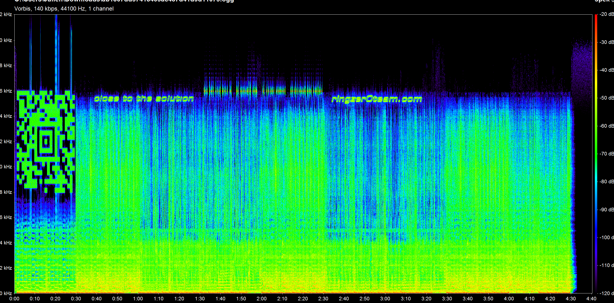
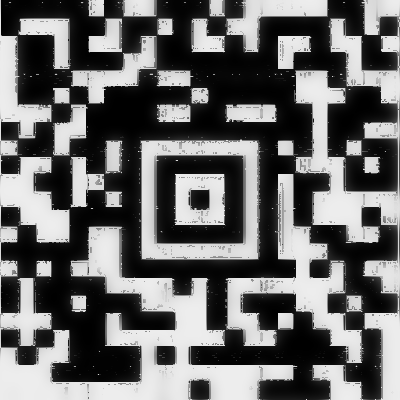

# SigID Level 1

## Description

https://ringzer0team.com/challenges/136

## Solution

We first open the `ogg` audio file with a [hexadecimal editor](https://mh-nexus.de/en/hxd/). We could also take a look at the field `COMMENTS` in the file media information.

```
OggS..........éj......‘ø7t...vorbis.....D¬......à"......¸.OggS..........éj......c¼P‚.ÿ%ÿÿÿÿÿÿÿÿÿÿÿÿÿÿÿ.vorbis....Xiph.Org libVorbis I 20070622........TRACKNUMBER=01(...ALBUM=http://ringzer0team.com/challenges....DATE=2014....TITLE=SigId - Level 1 Challenge....ARTIST=Guenaels...COMMENTS=Looking something hidden in the Tag/Raw data ? Nothing here, but check the works related to Joseph Fourier..vorbis+BCV
```

There is a tip: `Looking something hidden in the Tag/Raw data ? Nothing here, but check the works related to Joseph Fourier`.

After some research, we find that it is possible to [display a specific image in the spectrum analysis of an audio file](https://solusipse.net/blog/post/basic-methods-of-audio-steganography-spectrograms/). Our goal is then to do a spectrum analysis of the audio file.

Using [Spek](http://spek.cc/) or [Sonic Visualizer](http://www.sonicvisualiser.org/), we obtain the following diagram:



We can see a sign that looks like a QR code in the spectrum: in fact it is an [Aztec code](https://en.wikipedia.org/wiki/Aztec_Code). After some manipulation using Gimp to process the image we obtain the following aztec code that we can scan using a phone barcode scanner application like [QR Code Reader Extreme](https://play.google.com/store/apps/details?id=com.fancyapp.qrcode.barcode.scanner.reader&hl=en):



And we obtain the text `the flag is: mathsRulesTheUniverse`