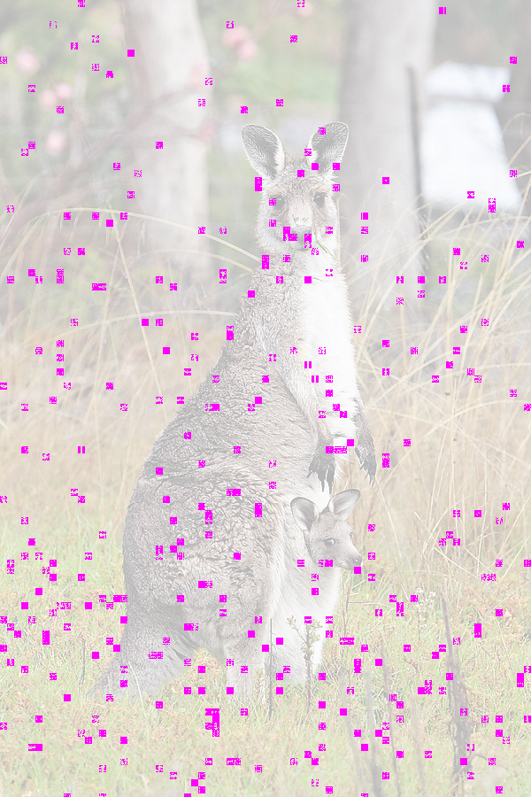

# Look inside the house

## Solution

We first open the `jpg` image file with a [hexadecimal editor](https://mh-nexus.de/en/hxd/) and search for any string but we find nothing in there.

After some research on image steganography, we find multiple tools available online. It seems like there is no standard and each tool has its own encode/decode method. Using [Steghide](http://steghide.sourceforge.net/) we are able to extract some hidden information from the image:

```
>steghide extract -sf 3e634b3b5d0658c903fc8d42b033fa57.jpg -p ''
reading stego file "3e634b3b5d0658c903fc8d42b033fa57.jpg"... done
extracting data... done
checking crc32 checksum... ok
writing extracted data to "flag.txt"... done
>cat flag.txt
FLAG-5jk682aqoepoi582r940oow
```

And we obtain the text `FLAG-5jk682aqoepoi582r940oow`

## More on steghide

Let's analyze how steghide is able to embed data without significantly modifying the appearance of the image. According to their [documentation](http://steghide.sourceforge.net/documentation/manpage.php): 

```
       Steghide uses a graph-theoretic approach to steganography.
       You do not need to know anything about graph theory to use
       steghide  and  you  can safely skip the rest of this para­
       graph if you are not interested in the technical  details.
       The  embedding  algorithm  roughly  works  as  follows: At
       first, the secret data is compressed and encrypted. Then a
       sequence  of  postions of pixels in the cover file is cre­
       ated based on a pseudo-random number generator initialized
       with  the  passphrase (the secret data will be embedded in
       the pixels at these positions). Of these  positions  those
       that  do not need to be changed (because they already con­
       tain the correct value by chance) are sorted out.  Then  a
       graph-theoretic  matching  algorithm  finds pairs of posi­
       tions such that exchanging their values has the effect  of
       embedding  the  corresponding  part of the secret data. If
       the  algorithm  cannot  find  any  more  such  pairs   all
       exchanges  are  actually  performed.   The  pixels  at the
       remaining positions (the positions that are  not  part  of
       such  a  pair)  are  also modified to contain the embedded
       data (but  this  is  done  by  overwriting  them,  not  by
       exchanging  them  with other pixels).  The fact that (most
       of) the embedding  is  done  by  exchanging  pixel  values
       implies  that  the first-order statistics (i.e. the number
       of times a color occurs in the picture)  is  not  changed.
```

Let's take the following image:


If we embed the file `test.txt` containing the sentence `Search for the FLAG!`:
```
>steghide embed -cf kangaroo.jpg -ef test.txt -p ''
embedding "test.txt" in "kangaroo.jpg"... done
```

We obtain the following image:


Diffing the bytes between the two files, we can see that nearly all of them differ. If we use a tool to [compare the images](https://huddle.github.io/Resemble.js/) pixel by pixel though, we can see blocks of 8x8 pixels that have been modified:



By analyzing the color difference we can see a very subtle variation of +/- 1 in RGB values.