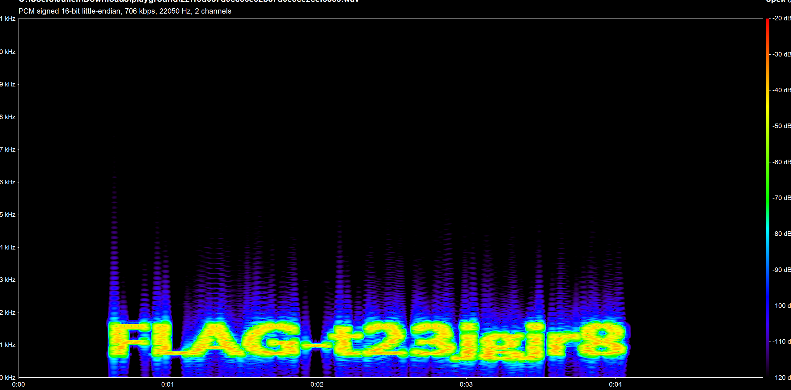

# TAPS team have recorded some ghost sound

## Solution

We do a spectrum analysis of the audio file. Using [Spek](http://spek.cc/) or [Sonic Visualizer](http://www.sonicvisualiser.org/), we obtain the following diagram:

We can see directly the flag from the spectrum `FLAG-t23jgjr8`